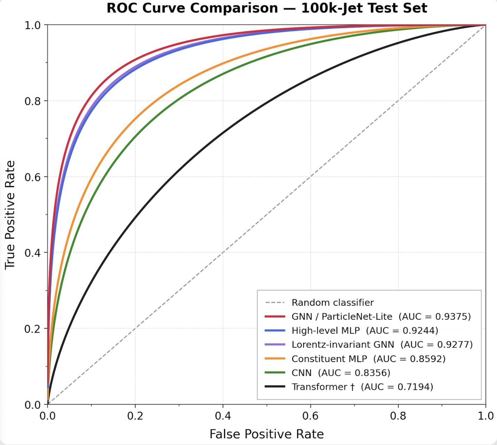
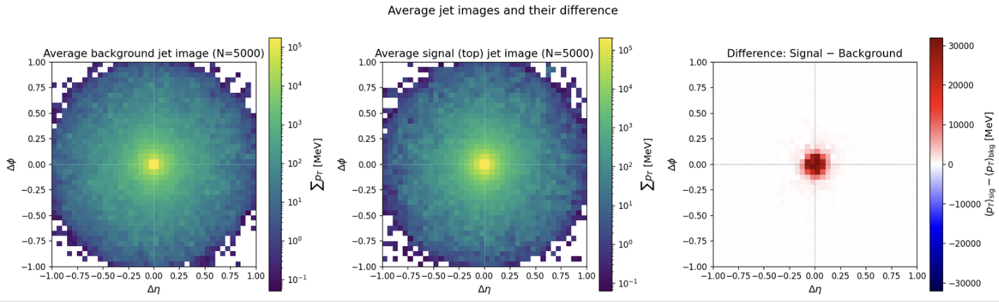
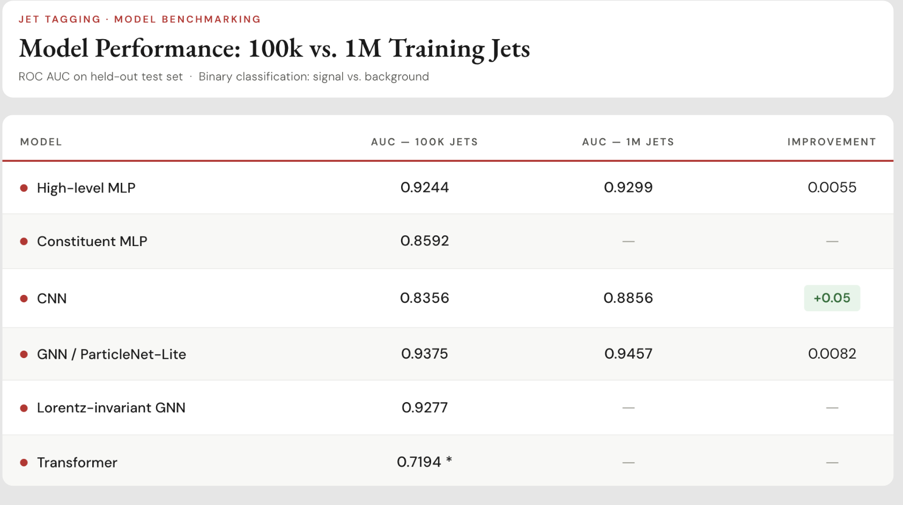

# Top Quark Jet Tagging with Deep Learning

<p align="center">
  <strong>Deep Learning for Top-Quark Identification</strong><br>
  <em>From expert-designed jet observables to constituent-level graph neural networks</em>
</p>

<p align="center">
  
</p>

---

## Overview

This project investigates **machine-learning methods for identifying hadronically decaying top quarks in high-energy particle-collision data**.

The central question is:

> **How much can we gain by moving from expert-designed jet observables to increasingly expressive representations of the jet's constituent structure?**

The project follows a progression from conventional high-level physics features to increasingly structured representations:

| Representation | Model | Main idea |
|---|---|---|
| High-level observables | **MLP** | Expert-engineered jet-substructure variables |
| Constituents | **Flattened MLP** | Raw constituent information without an explicit geometric inductive bias |
| Jet image | **CNN** | Spatial correlations in the $(\eta,\phi)$ plane |
| Particle cloud | **ParticleNet-Lite / GNN** | Relational learning on an unordered set of constituents |
| Future work | Transformer / equivariant architectures | Attention and stronger symmetry-aware representations |

The code is built around **configuration-driven experiments**, with YAML files defining data, model, optimisation, training and evaluation settings.

---

## Why Top-Quark Jet Tagging?

At sufficiently high transverse momentum, the decay products of a top quark become highly collimated and can be reconstructed as a single jet.

A hadronic top decay,

$$
t \rightarrow Wb \rightarrow q\bar q' b,
$$

therefore leaves a characteristic pattern of radiation and substructure inside the jet.

<p align="center">
  
</p>

The figure shows the average constituent activity for background and top jets in the $(\Delta\eta,\Delta\phi)$ plane, together with their difference. The visual distinction is subtle, motivating models that can learn more informative representations of the constituent-level structure.

---

## Dataset

The project uses the **ATLAS Top Tagging Open Data** format stored in HDF5 files.

The raw data are intentionally **not included in the repository** and are ignored by Git.

Expected local structure:

```text
data/
└── raw/
    ├── train_nominal_000.h5
    └── test_nominal_000.h5
```

The training pipeline performs the train/validation split internally. External test evaluation reuses the scaler fitted on the training data when standardisation is enabled, avoiding data leakage.

---

## Model zoo

### High-level MLP

A multilayer perceptron using 15 hand-crafted jet-substructure observables, including energy-correlation functions, splitting scales, $N$-subjettiness and thrust.

This provides the **physics-informed baseline**.

### Constituent MLP

The constituent four-momenta are transformed using an ATLAS-inspired preprocessing pipeline and flattened into a one-dimensional vector.

This model has access to low-level information but does not explicitly encode permutation invariance or geometric relations.

### CNN on jet images

Each jet is represented as a $40\times40$ image in $(\Delta\eta,\Delta\phi)$.

A convolutional network learns local spatial patterns in the image.

### ParticleNet-Lite / GNN

The most structured model currently implemented operates directly on the constituent point cloud.

A $k$-nearest-neighbour graph is constructed in $(\eta,\phi)$ space and EdgeConv-style blocks learn relational features between constituents. The jet is therefore treated as a **set of particles rather than an ordered vector**.

---

## Benchmark results

The current 100k-jet held-out benchmark gives:

| Model | AUC |
|---|---:|
| **ParticleNet-Lite / GNN** | **0.9375** |
| Lorentz-invariant GNN | 0.9277 |
| High-level MLP | 0.9244 |
| Constituent MLP | 0.8592 |
| CNN | 0.8356 |
| Transformer† | 0.7194 |

<p align="center">
  
</p>

### Scaling with training-set size

For the experiments for which both training sizes are available:

| Model | AUC — 100k jets | AUC — 1M jets | Improvement |
|---|---:|---:|---:|
| High-level MLP | 0.9244 | 0.9299 | +0.0055 |
| CNN | 0.8356 | 0.8856 | +0.0500 |
| ParticleNet-Lite / GNN | 0.9375 | 0.9457 | +0.0082 |

The CNN shows the largest gain when increasing the training sample from 100k to 1M jets, while ParticleNet-Lite remains the strongest of the compared architectures.

<p align="center">
  
</p>

† The Transformer value is reproduced from the current benchmark figure and is marked there as a special case. Its exact training/evaluation setup should be checked before treating it as directly comparable.

---

## Repository structure

```text
Top-Quark-Jet-Tagging/
│
├── README.md
├── .gitignore
│
├── configs/                    # YAML experiment configurations
├── data/                       # Local datasets — NOT tracked by Git
│   └── raw/
├── docs/                       # Documentation and README assets
│   └── assets/
├── figures/                    # Generated analysis and model figures
├── notebooks/                  # Exploratory and baseline notebooks
│   ├── 01_data_exploration.ipynb
│   ├── 01_data_exploration_firstcode.ipynb
│   └── 02_mlp_baseline_high_level.ipynb
├── scripts/                    # Training and evaluation entry points
├── src/                        # Main Python package
└── presentation/               # Interactive HTML presentation
```

Data, checkpoints, logs and generated training artefacts stay out of version control; the code and configurations remain tracked.

---

## Getting started

Place the ATLAS HDF5 files under `data/raw/`.

### Train

```bash
python scripts/train.py --config configs/mlp_highlevel.yaml
```

Other architectures:

```bash
python scripts/train.py --config configs/mlp_constituents.yaml
python scripts/train.py --config configs/cnn_jetimage.yaml
python scripts/train.py --config configs/particlenet_lite.yaml
```

### Evaluate the validation split

```bash
python scripts/evaluate.py     --config configs/mlp_highlevel.yaml     --checkpoint results/mlp_highlevel_baseline/checkpoints/<best_checkpoint>.ckpt
```

### Evaluate the external test set

```bash
python scripts/evaluate.py     --config configs/mlp_highlevel.yaml     --checkpoint results/mlp_highlevel_baseline/checkpoints/<best_checkpoint>.ckpt     --data-path data/raw/test_nominal_000.h5     --split test
```

The evaluation pipeline produces ROC curves, score distributions, confusion matrices and $p_T$-binned background rejection where configured.

---

## Reproducibility

Experiments are controlled through YAML configuration files.

Each run records the random seed, architecture, optimiser, scheduler, preprocessing, dataset sizes, best checkpoint and preprocessing artefacts. The training script also stores a copy of the YAML configuration used for the run.

---

## Project roadmap

- [x] Dataset exploration and preprocessing
- [x] High-level MLP baseline
- [x] Constituent-level MLP
- [x] CNN jet-image baseline
- [x] ParticleNet-Lite / GNN
- [x] Common evaluation and ROC benchmarking
- [x] External test-set evaluation pipeline
- [ ] Larger-scale training on the full dataset
- [ ] Additional symmetry-aware / Lorentz-equivariant architectures
- [ ] More systematic hyperparameter optimisation
- [ ] Detailed $p_T$-dependent performance comparison

---

## Presentation

The project is accompanied by an interactive **HTML presentation** covering the physics motivation, dataset, representations, architectures, training strategy and results.

It will live under:

```text
presentation/
```

---

## Acknowledgements

This project is based on the **ATLAS Top Tagging Open Data** and is intended as a machine-learning study of jet substructure and top-quark identification.
